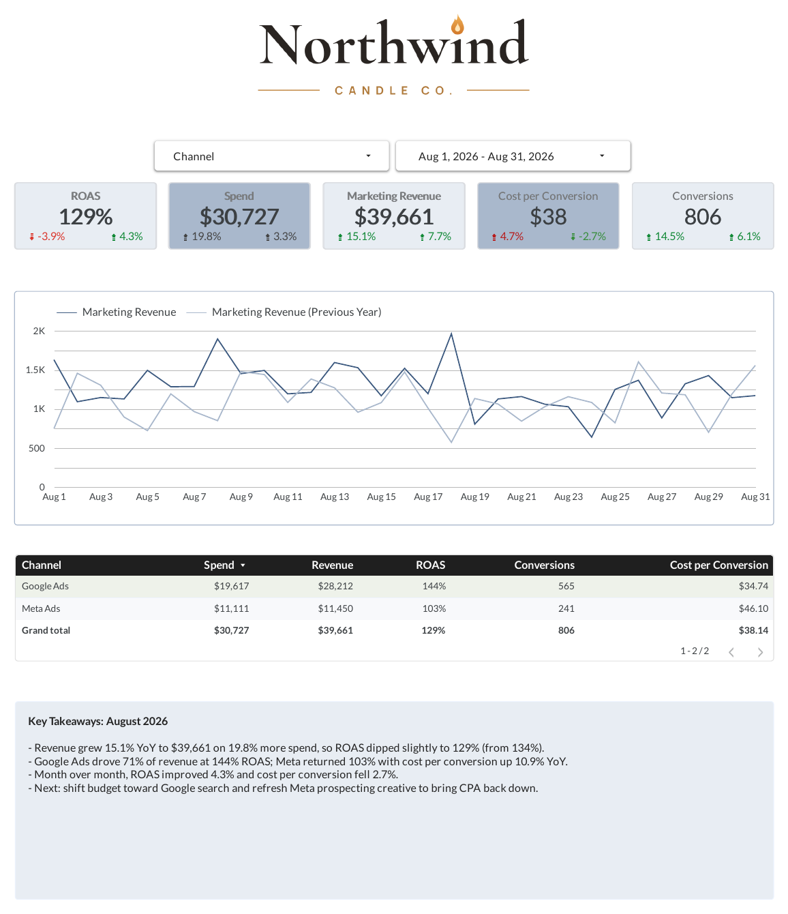
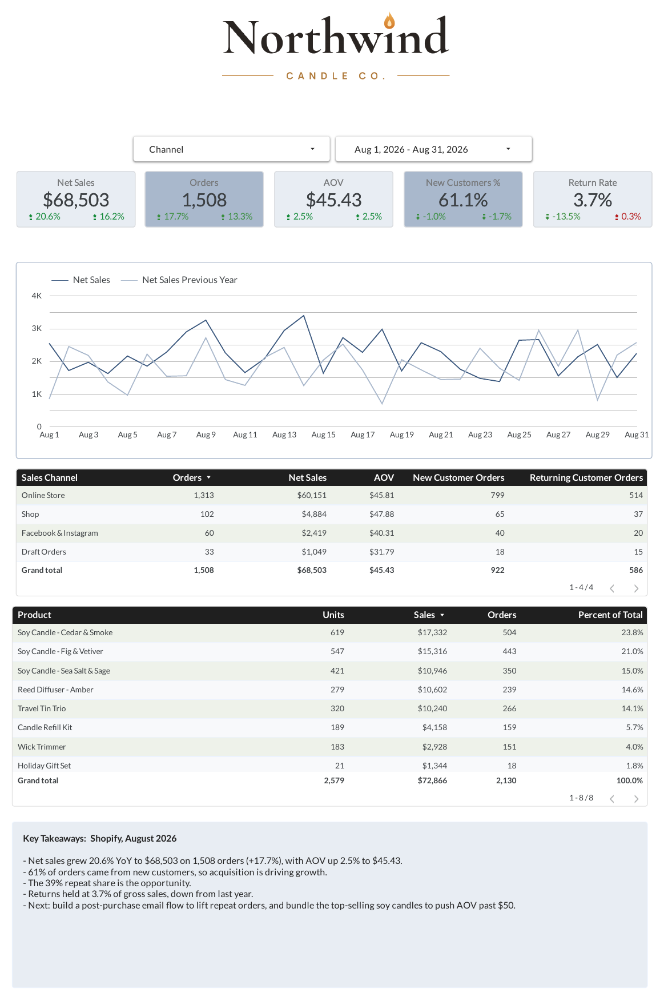
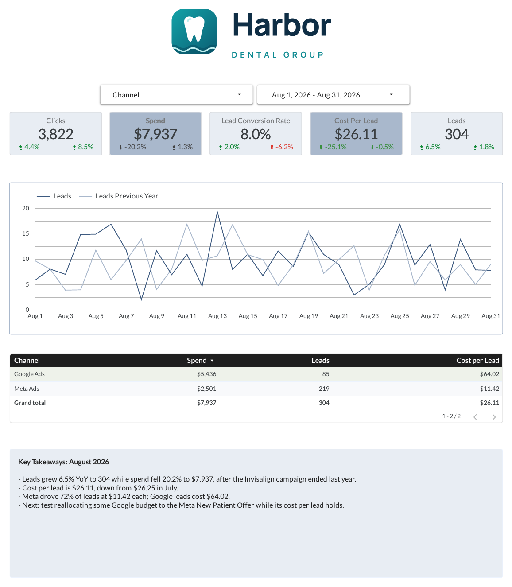
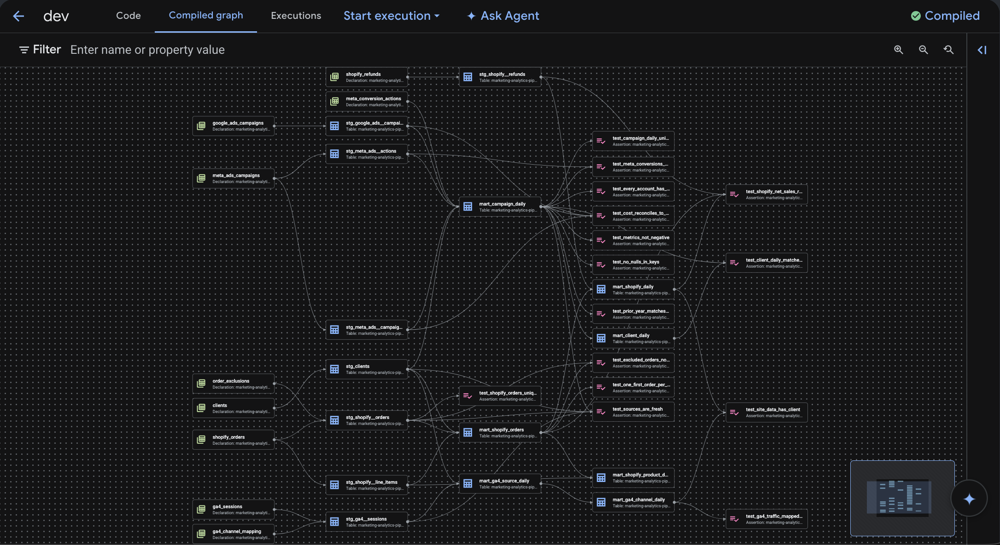

# Marketing Analytics Pipeline

A marketing reporting pipeline in BigQuery: Google Ads, Meta, Shopify and GA4 data → cleaned staging tables → reporting marts → client dashboard, with automated data quality tests.

It's modeled on a production agency reporting stack I maintained, which combined ad platforms, Shopify, GA4 and other sources into client dashboards through scheduled BigQuery queries. This is a rebuild from scratch. The architecture is the same, but the design fixes the problems I ran into keeping the original running.

> **Data note:** all data is synthetic, generated by `ingestion/generate_ad_data.py` and `ingestion/generate_site_data.py`: three invented clients (two e-commerce, one lead gen), January 2024 through September 2026, with seasonal campaigns and year-over-year budget growth. Client names, account IDs, campaign IDs and logos are invented. The generators reproduce the real-world messiness of connector data on purpose, so the pipeline has actual problems to solve. They use fixed random seeds, so the data isn't stored in the repo; running them recreates it exactly.

## The original stack vs. this rebuild

| | Original (agency, production) | This rebuild |
|---|---|---|
| Data in | Funnel and Weavely synced ad platform, Shopify and GA4 data into BigQuery | Python generators produce the same connector-style raw tables, mess included (no paid connector needed) |
| Transformation | Scheduled queries, each on its own timer, 200–350 lines from raw to dashboard | Layered staging and mart models, run in dependency order by a Python runner or Dataform |
| Testing | None. Bugs changed numbers silently | 15 data quality tests that run after every build |
| Reporting | Client dashboards in Looker Studio | One Looker Studio report per client, checked against the pipeline |

Everything from BigQuery onward mirrors how the original worked. The connectors are the only piece that isn't real, since this project has no live ad accounts.

## The client reports

One Looker Studio (Data Studio) report per client, each locked to that client with a report-level filter, built on the marts below and checked number-for-number against the pipeline.

| Client | Type | Pages | Live report | PDF |
|---|---|---|---|---|
| Northwind Candle Co. | E-commerce | Overview · Meta Ads · Google Ads · Shopify · Google Analytics | [Open in Looker Studio](https://datastudio.google.com/reporting/9865b1f6-458b-4273-a118-6fecac89461d) | [August 2026](docs/reports/northwind-candle-co.pdf) |
| Summit Outdoor Supply | E-commerce | Overview · Meta Ads · Google Ads · Shopify · Google Analytics | [Open in Looker Studio](https://datastudio.google.com/reporting/d95f2ea8-a3c7-4f62-a695-7b6f86922f04) | [August 2026](docs/reports/summit-outdoor-supply.pdf) |
| Harbor Dental Group | Lead gen | Overview · Meta Ads · Google Ads · Google Analytics | [Open in Looker Studio](https://datastudio.google.com/reporting/8e46cf34-9939-45f9-99e5-4befaa17ac0e) | [August 2026](docs/reports/harbor-dental-group.pdf) |

<p>
  
  
  
</p>

What the pages show:
- **Scorecards with YoY and month-over-month change** on every page. Data Studio only allows one comparison per scorecard, so each card is two scorecards layered on top of each other.
- **This year vs. last year** on every trend chart, from prior-year columns computed in SQL.
- **Lead-gen KPIs for the lead-gen client:** cost per lead, lead conversion rate and clicks instead of ROAS and revenue.
- **Platform-reported vs. measured revenue.** For Northwind in August 2026, Google Ads claims $28,212 in revenue and GA4 credits it with $17,384; Meta claims $11,450 and GA4 credits $9,033. The Google Analytics page calls this out, because budget decisions based on platform ROAS would overspend.
- **Written takeaways** on each page, drawn from the numbers on it ([all takeaways](docs/takeaways_aug_2026.md)).

All page screenshots are in [`docs/screenshots`](docs/screenshots).

## Architecture

```
ingestion/generate_ad_data.py, generate_site_data.py
        │  (stand in for connectors like Funnel or Weavely)
        ▼
raw          google_ads_campaigns, meta_ads_campaigns, shopify_orders,
             shopify_refunds, ga4_sessions, clients
reference    meta_conversion_actions, ga4_channel_mapping, order_exclusions
        │
        ▼
staging      stg_google_ads__campaigns    deduplicated, one row per campaign-day
             stg_meta_ads__campaigns      deduplicated, cleaned names
             stg_meta_ads__actions        nested conversion arrays flattened
             stg_shopify__orders          deduplicated, UTC → store time zone, flags
             stg_shopify__line_items      nested line items flattened
             stg_shopify__refunds         dated on refund day
             stg_ga4__sessions            cleaned source/medium, channel assigned
             stg_clients                  account / store / property → client
        │
        ▼
marts        mart_campaign_daily          all ad platforms in one schema
             mart_client_daily            rollup of mart_campaign_daily
             mart_shopify_orders          real orders, new vs. returning customer
             mart_shopify_daily           gross, discounts, returns, net sales
             mart_shopify_product_daily   product sales
             mart_ga4_source_daily        traffic by source / medium / campaign
             mart_ga4_channel_daily       traffic by channel, with last year
        │
        ▼
tests/       15 data quality checks (Dataform assertions in dataform/)
dashboard    Looker Studio (Data Studio): one report per client
```

## Running it

```bash
pip install -r requirements.txt

# Recreate the raw data (same every time)
python ingestion/generate_ad_data.py
python ingestion/generate_site_data.py

# Locally, no cloud account needed
python pipeline/run.py --target local

# Or in BigQuery (the free sandbox works)
gcloud auth application-default login
python pipeline/run.py --target bigquery --project YOUR_PROJECT_ID
```

The runner loads the raw data, builds each model in dependency order, then runs every test. Model files are plain `SELECT` statements in BigQuery SQL. The local target translates them to DuckDB with sqlglot, so the same SQL runs in both places.

### In BigQuery with Dataform

The same models also run in [Dataform](https://cloud.google.com/dataform), BigQuery's built-in tool for managing SQL pipelines. `dataform/` is generated from `sql/` and `tests/`:

```bash
python pipeline/export_dataform.py   # regenerates dataform/ from sql/ and tests/
```

Table names become `${ref()}` calls, which is how Dataform builds the dependency graph, and each test becomes an assertion that must return zero rows. Raw and reference tables are declared as sources, since loading them stays with `pipeline/run.py`. The compiled Dataform SQL is identical to the files in `sql/` and `tests/`, so both ways of running the pipeline produce the same tables.



*The compiled graph in BigQuery: 9 raw and reference sources (left) feed 8 staging tables and 7 marts, with the 15 tests as assertions.*

A full Dataform run in BigQuery executes all 30 actions (15 tables, 15 assertions) in about 16 seconds, with every assertion passing.

## What the data throws at the pipeline

| Problem in the raw data | How it's handled | Test that catches a regression |
|---|---|---|
| Connector re-syncs the same day twice, and the later sync has more complete conversions | Keep the latest sync per campaign-day with `QUALIFY ROW_NUMBER()`. `DISTINCT` wouldn't work because the duplicates aren't identical. Without this, spend is overstated by about $2,500 on Google and $950 on Meta. | `test_campaign_daily_unique` |
| Meta reports each purchase under three action types | A reference table marks one primary action per conversion type, so each purchase is counted once | `test_meta_conversions_not_double_counted` |
| Meta conversions are nested arrays at a finer grain than spend | Flatten with `UNNEST`, then aggregate to campaign-day *before* joining to spend, which avoids fan-out | `test_cost_reconciles_to_staging` |
| Campaigns get renamed mid-year | `campaign_id` is the identity. Every day reports under the current name, and the name on each date is kept in a separate column. | — |
| Values arrive as strings, zero-value actions are omitted, and names have trailing spaces | `SAFE_CAST`, `COALESCE`, `TRIM` in staging | `test_metrics_not_negative` |
| A new ad account nobody mapped to a client | Client mapping lives in its own table | `test_every_account_has_a_client` |
| Data Studio's built-in "previous year" comparison came back empty on time-series charts | Prior-year cost, conversions and revenue are computed in SQL as columns on the mart (shifted one year, full outer join so ended campaigns still count), so every chart plots them as ordinary metrics | `test_prior_year_matches_last_year` |
| Shopify re-sends an order every time it changes (e.g. a refund) | Keep the latest `updated_at` per order | `test_shopify_orders_unique` |
| Shopify timestamps are UTC, so late-evening orders land on the next day | Convert to the store's time zone before taking the date | — |
| A card-testing spam burst: 85 one-dollar orders in 45 minutes, plus test orders | Flagged from `reference/order_exclusions.csv` and the `test` field; removed before any reporting. Replaces a hard-coded `NOT IN (...)` list of order IDs. | `test_excluded_orders_not_in_marts` |
| New vs. returning customer was miscounted in the original when ranking ran inside a date window | Each customer's first order is found across their full history, after spam is removed | `test_one_first_order_per_customer` |
| Refunds happen days after the order | Returns are reported on the refund date, matching Shopify's own sales reports; net sales = gross − discounts − returns | `test_shopify_net_sales_reconciles` |
| GA4 source/medium spellings are inconsistent (`facebook / paid_social`, `fb / paid`, `Facebook / CPC`, `Klaviyo / Email`...) | Lowercased, then grouped by a priority-ordered regex mapping table instead of a long `CASE` statement. An `Other` catch-all keeps unmapped traffic visible. | `test_ga4_traffic_mapped_to_channels` |
| A source stops syncing partway through a month, and the dashboard quietly shows a drop or "No data" | Every ad account, store and GA4 property is checked against the newest data in the warehouse | `test_sources_are_fresh` |

Each test returns the rows that break a rule, so passing means zero rows. I checked the tests by breaking the pipeline on purpose (removing dedup, counting every Meta purchase alias, joining at the wrong grain, unmapping an account, cutting off one account's data early, removing order dedup, letting spam through, ranking customers inside a window, deleting a channel mapping rule) and confirming the right tests fail.

## Design decisions, and the production problems behind them

These come from maintaining the original system:

- **Layers instead of one giant query.** The original reports were single queries of 200–350 lines that went straight from raw tables to dashboard. Here each step is small and testable on its own.
- **The overview is built on the campaign table.** The original had two nearly identical 350-line queries, one per level of detail, that could drift apart. Here `mart_client_daily` is a 15-line rollup of `mart_campaign_daily`, and a test guarantees they match.
- **Lookups in tables, not in SQL.** Client names, account mappings, conversion definitions, and order exclusions were hardcoded in `CASE` statements and `NOT IN (...)` lists. Here they're reference tables anyone can audit.
- **One shared set of columns.** The original gave each source its own columns (`source_a_conversions`, `source_b_conversions`...) padded with `0 AS ...` everywhere else, so adding a source meant editing every block. Here every platform maps into the same columns.
- **Steps run in order.** The original scheduled each query on its own clock, so a query could read a table before it was refreshed. The runner builds models in dependency order.
- **Tests exist.** Bugs I found in the original (an `AND`/`OR` precedence error that dropped a date filter, a join at mismatched grains that inflated conversions, a debug filter left in a scheduled query) all changed numbers silently. Every test here targets a failure like those.
- **Sources disagree, and the report shows it.** Ad platforms each claim credit for the same customers, so Google and Meta together report more revenue than GA4 attributes to them, and GA4 misses some orders that Shopify records. Keeping all three side by side (platform-reported, GA4, Shopify) is more honest than picking one.
- **Ratios aren't stored.** ROAS and CPA are calculated in the dashboard from summed totals (`SUM(value) / SUM(cost)`), because averaging daily ratios gives the wrong answer.

## Roadmap

- [x] Google Ads + Meta → cross-channel campaign and client marts, with tests
- [x] Shopify orders: net sales, returns, new vs. returning customers, spam-order exclusions
- [x] GA4 sessions and channel grouping via a mapping table
- [x] Looker Studio reports: one per client, with Overview, Meta, Google, Shopify and Google Analytics pages
- [ ] Incremental loads: only process new days, with `MERGE` (needs billing enabled; the sandbox doesn't allow DML)
- [x] Dataform version of the SQL (`dataform/`), generated from `sql/` and `tests/`
- [ ] Klaviyo email performance
